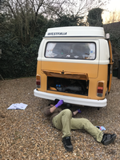
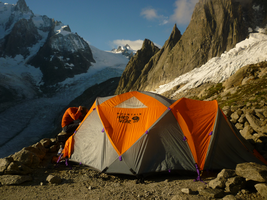
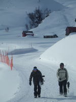
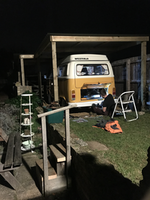
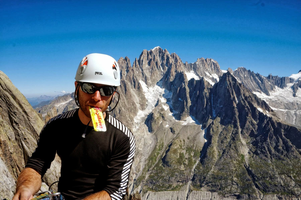

## Welcome to Will's Project Page

Basically, this is a collection of odds and sods that I find interesting, but I'll start with a micro-Bio

### Bio

Some things about me, in no particular order
- Big outdoors fan, still pretending to be a committed climber despite lack of time and access
- (very) junior level autodidact in historic internal combustion engineering
- Currently a research chemist, trying to drag others into the software-age
- A self-proclaimed failure in devising useful and interesting home Raspberry Pi projects
- Enjoy learning almost anything, if time allows
- Current mad idea - acquire '70s Mini and DIY convert to full Electric Vehicle
- Not a fan of Identity Politics, but if I had to pick one; probably 

---

---

### Links to stuff

[tester notebook slides](slides/test.slides.html)  

[Codeworks](slides/DataAdventure.html)

